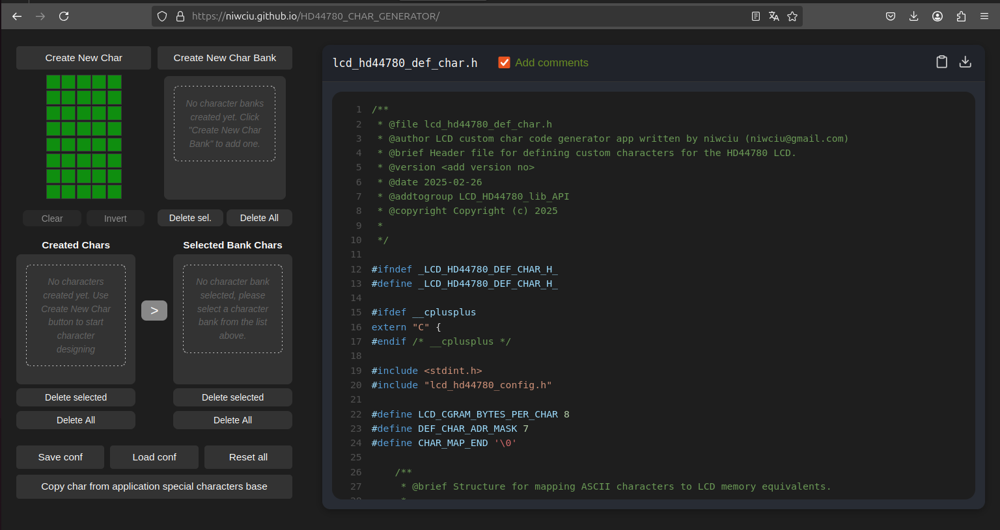

# HD44780 Custom Character Generator

[](https://niwciu.github.io/HD44780_CHAR_GENERATOR/)
[](LICENSE)

A web-based tool for creating custom characters and icon banks for HD44780-compatible LCD displays. Generates ready-to-use code for [LCD HD44780 lib - simple cross-platform C library](https://github.com/niwciu/LCD_HD44780).

 

## Features

- **Visual Character Editor**: 5x8 pixel grid with live preview
- **Character Bank Management**: Create and manage up to 8 characters per bank
- **Code Generation**: Automatic C code generation with optional comments
- **Configuration Saving**: Save/load character configurations as JSON files
- **Live Preview**: Instant preview of generated characters
- **Bank System**: Supports multiple character banks for complex projects
- **Comments Toggle**: Generate code with or without descriptive doxygen comments

## Live Deployment

The application is available online at:  
[https://niwciu.github.io/HD44780_CHAR_GENERATOR/](https://niwciu.github.io/HD44780_CHAR_GENERATOR/)

## Related Project

This tool generates code specifically for use with:  
[**LCD HD44780 lib - simple cross-platform C library**](https://github.com/niwciu/LCD_HD44780)  
A cross-platform C library for controlling HD44780-compatible LCD displays

## Installation

To run locally:

1. Clone repository:
```bash
git clone https://github.com/niwciu/HD44780_CHAR_GENERATOR.git
```
2. Install dependencies:
```bash
npm install
```
3. Start development server:
```bash
npm run dev
```

## Usage
### Creating Characters

- Click "Create New Char"
- Name your character abd dclick OK
- Edit pixels using the 5x8 grid - changes will save automatically.

### Managing Banks

- Create character banks with "Create New Char Bank"
- Name your character bank and dclick OK
- Select character bank on bank list that you want to add the char to.
- Select char on char list that you want to add to the selectesd previously character bank.
- Add selected char to selected bank using the ">" button

NOTE: Each Characters Bank supports up to 8 characters.

### Generating Code

- Configure characters and banks
- Code preview updates automatically in right panel
-  Add or remove comments from code using the "Add Comments" checkbox
- Copy or save to file generated code for use with LCD_HD44780 library. For this purpose  use code preview menu  buttons in right top corner.

### Configuration Management
You can reset, save to file and restore from saved file your custom characters configuration.  
For this purpose use fallowing buttons: 

- Save: Export current configuration as JSON file
- Load: Import selected configurations from JSON file
- Reset: Clear all characters and banks

## Contributing

Contributions are welcome! Please follow these steps:

1) Fork the repository
2) Create your feature branch
3) Commit your changes
4) Push to the branch
5) Create a new Pull Request

## License

This project is licensed under the MIT License - see the LICENSE file for details.